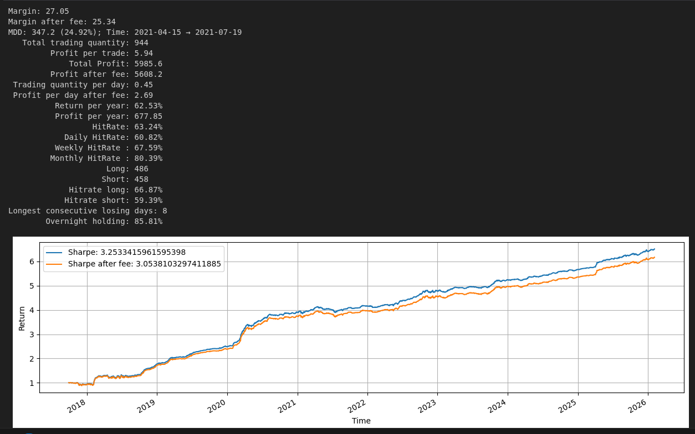
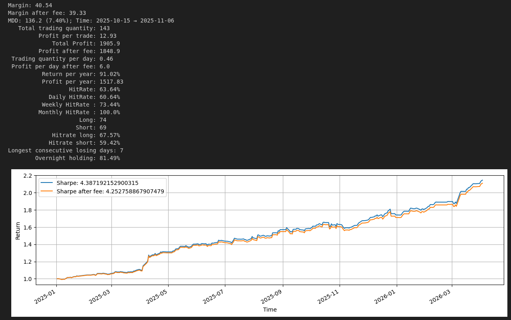

# NGUYEN MINH HIEU
### Quantitative Developer | Alpha Research & System Engineering
**Email:** nguyenhieunolo.@gmail.com | **Location:** Hanoi, Vietnam

---

## 📈 Live Trading Performance (Real-time)
*Hệ thống giao dịch tự động tích hợp trực tiếp với EntradeX (VN30F) và Binance (Crypto).*

### 📊 VN30F1M Portfolio  Curve
> Biểu đồ thông số alpha, bao gồm phí giao dịch và trượt giá (Slippage).

### ✅ Key Performance Metrics (Last 12 Months)

> [👉 Truy cập Real-time Dashboard Trading (Streamlit)](https://deploywebps-ckps-emhieutrading.streamlit.app/)  
> *Ghi chú: Dữ liệu được cập nhật mỗi 5 phút trực tiếp từ Execution Logs.*

---

## 🔬 Alpha Intelligence & Dynamics
*Quản lý danh mục đa dạng các tín hiệu Alpha bền vững với biến động thị trường.*

### Alpha Factor Characteristics:
- **Mean Reversion (60%):** Khai thác sự mất cân bằng cung cầu dựa trên Volume-Weighted Average Price (VWAP) và Orderbook Imbalance.
- **Trend Following (40%):** Nhận diện xu hướng sớm dựa trên các bộ lọc nhiễu tự xây dựng (Adaptive Noise Filters).

### Optimization Framework:
- **Parameter Robustness:** Sử dụng **Optuna** với phương pháp **Walk-forward Optimization** để tìm bộ tham số ổn định nhất, hạn chế tối đa Overfitting.
- **Backtest-to-Live Synchronization:** Module xử lý logic khớp lệnh mô phỏng sát **95%** so với thực tế, giải quyết triệt để bài toán sai lệch logic giữa nghiên cứu và thực thi.

---

## 🛠 Quantitative Operations (Ops) Optimization
*Để thể hiện quá trình tối ưu vận hành (Ops), tôi tập trung vào 3 trụ cột chính:*

#### 1. Low-Latency Execution & Computation (Performance)
- **Tối ưu hóa tính toán:** Leveraged **Numba JIT** và **Vectorization** để chuyển đổi các vòng lặp Python chậm chạp thành code mã máy tốc độ cao.
- **Kết quả:** Giảm độ trễ tính toán tín hiệu (Signal Generation Latency) xuống dưới **[X] ms**, đảm bảo lợi thế cạnh tranh khi thị trường biến động mạnh.

#### 2. Agentic AI Monitoring & Error Handling (Reliability)
- **Vận hành tự động:** Architected một hệ thống **Agent AI** (tự xây dựng) chuyên quét Log thực thi 24/7.
- **Kết quả:** Tự động phát hiện Bug, lỗi kết nối API, hoặc dữ liệu rác (Dirty Data) và thực hiện **Proactive Reset** bot mà không cần can thiệp thủ công, duy trì uptime **99.9%**.

#### 3. Automated Data Pipeline & ETL (Efficiency)
- **Xử lý dữ liệu:** Xây dựng luồng ETL tự động cho dữ liệu Tick-level và Orderbook.
- **Kết quả:** Tự động làm sạch, dán nhãn và lưu trữ dữ liệu vào database hiệu suất cao, giúp rút ngắn thời gian nghiên cứu Alpha mới từ vài ngày xuống còn vài giờ.

---

## 🎓 Education & Technical Stack
- **Hanoi University of Science and Technology (HUST)** | IT Graduate (Class of 2025)
- **Core:** Python, C++, SQL (PostgreSQL/MySQL), Linux, Docker, Git.
- **Quant:** Pandas, NumPy, SciPy, Numba, Optuna, Scikit-learn, Streamlit.

---

[📥 Download Full CV (PDF)](./CV_Nguyen_Minh_Hieu.pdf)
